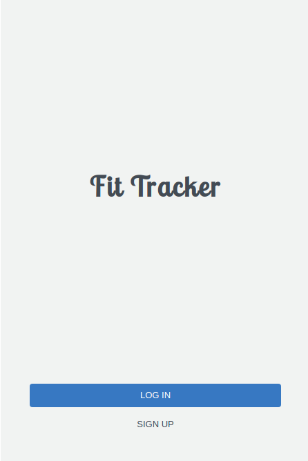
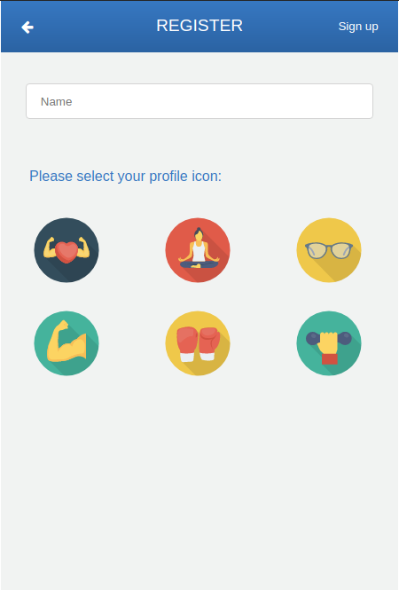
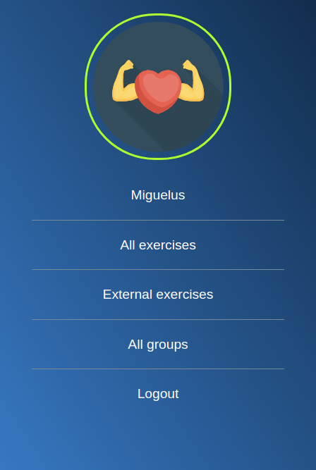
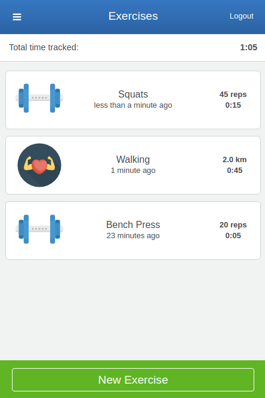

# Fit Tracker

> This is a fitness app to track all the exrcises you make and also group them by categories.






## Built With

- Ruby v2.7.0
- Ruby on Rails v6.0.3.4
- Rubocop / Stylelint
- Rspec / Capybara

## Live Demo

[Click here to check Fit Tracker](https://glacial-badlands-05067.herokuapp.com)

## Getting Started

To get a local copy up and running follow these simple example steps.

### Prerequisites

Ruby 2.7+
Rails 6+
Postgres: 9.5+

### Setup

Get a local copy by running this command on your terminal:

```
git clone https://github.com/Miguelus373/Fit-Tracker.git
```

Install all required gems with:

```
bundle install
```

Setup database with:

```
   rails db:create 
   rails db:migrate
```


### Usage

Start a server with:

```
    rails server
```

Go to `http://localhost:3000/` on your browser.


### Run tests

To checkout the tests just run the following command:

```
    rpsec 
```

> Unit and Integration Test has been implemented using RSpec and Capybara.

### Deployment

This app is available on Heroku through the live demo link (check Live Demo above)

## ✒️ Author

👤 **Miguel Uzcátegui**

- Github: [@Miguelus373](https://github.com/Miguelus373)
- LinkedIn:[LinkedIn](https://www.linkedin.com/in/Miguelus373)

## 🤝 Contributing

Contributions, issues and feature requests are welcome!

Feel free to check the [issues page](https://github.com/Miguelus373/Fit-Tracker/issues).

## Show your support

Give a ⭐️ if you like this project!

## Acknowledgments

- Design idea by [Gregoire Vella on Behance](https://www.behance.net/gregoirevella)
- This is the Microverse capstone project
- All the icons on the app come from [Flaticon](https://www.flaticon.com/)

## 📝 License
This project is [MIT](lic.url) licensed.

